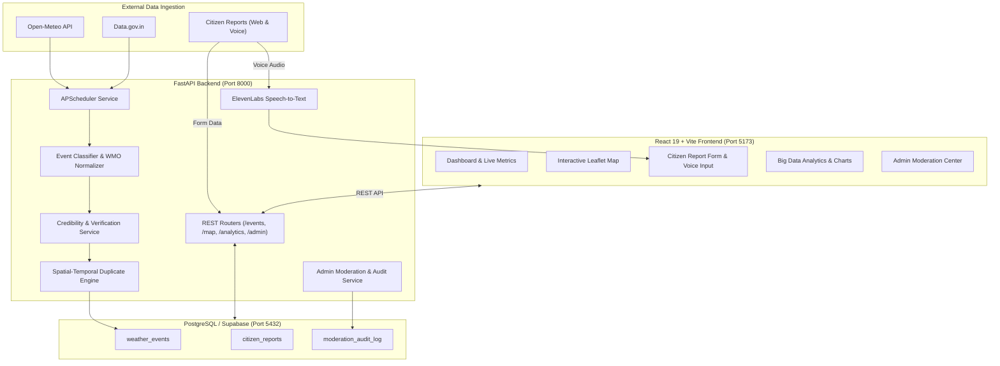

# 🌦️ National Weather Big Data Analytics Platform

[](https://fastapi.tiangolo.com/)
[](https://react.dev/)
[](https://www.typescriptlang.org/)
[](https://supabase.com/)
[](https://vitejs.dev/)
[](https://leafletjs.com/)
[](https://elevenlabs.io/)

A scalable, real-time big data analytics, geospatial monitoring, and citizen reporting platform designed for extreme weather events across India. The platform ingests real meteorological data, cross-references official sources with crowdsourced ground reports, performs automated credibility verification and spatial-temporal duplicate detection, and provides an administrative moderation suite for emergency disaster management.

---

## 📌 Table of Contents

- [Key Features](#-key-features)
- [System Architecture](#-system-architecture)
- [Tech Stack](#-tech-stack)
- [Project Structure](#-project-structure)
- [Prerequisites](#-prerequisites)
- [Environment Configuration](#-environment-configuration)
- [Quick Start Guide](#-quick-start-guide)
  - [1. Backend Setup](#1-backend-setup)
  - [2. Frontend Setup](#2-frontend-setup)
- [API Endpoints & Documentation](#-api-endpoints--documentation)
- [Automated Verification & Credibility Engine](#-automated-verification--credibility-engine)
- [Running Test Suites](#-running-test-suites)
- [Production Build](#-production-build)
- [Security & Data Integrity](#-security--data-integrity)
- [License](#-license)

---

## ✨ Key Features

### 📡 Multi-Source Weather Data Ingestion
- **Automated Open-Meteo Integration**: Ingests real-time physical meteorological parameters (temperature, precipitation, wind speed/direction, pressure, relative humidity) across major Indian urban and rural coordinates.
- **Data.gov.in & Open Government Data**: Built-in adapter for national government datasets and historical weather records.
- **IMD / IMD-RSS Compatibility**: Normalizes Indian Meteorological Department bulletins and standardized WMO weather codes.
- **Background Scheduler (APScheduler)**: Configurable background daemon for automated polling and data synchronization without blocking user requests.

### 🧠 Intelligent Classification & Credibility Engine
- **Automated Weather Event Classifier**: Maps raw sensor data, WMO weather codes, and text descriptions into 10 standardized event categories (*Rainfall, Heavy Rain, Thunderstorm, Flooding, Heatwave, Fog, Dust Storm, Strong Wind, Cyclone, Other*).
- **Multi-Factor Credibility Scoring (0–100%)**: Algorithmically assesses source reliability, parameter plausibility, geospatial consistency, and multi-source corroboration.
- **Spatial-Temporal Duplicate Detection**: Employs Haversine distance formulas and temporal window clustering to flag redundant incidents while preserving parent event links (`duplicate_of`).

### 🗺️ Geospatial Monitoring & Interactive GIS
- **India-Centric Interactive Map**: High-performance interactive map built with Leaflet and React-Leaflet with bounding-box optimization for Indian states and union territories.
- **Dynamic Layer Filtering**: Filter incidents by event category, verification status (*Verified, Likely, Unverified, Rejected*), date ranges, and confidence thresholds.
- **Proximity & Radius Visualizer**: Pinpoint ground incidents with coordinate capture and reverse geocoding.

### 👥 Citizen Weather Reporting with Voice AI
- **Crowdsourced Disaster Reports**: Citizens can submit field observations with multimedia (photos/videos) and GPS coordinates.
- **Multilingual Speech-to-Text (ElevenLabs Scribe v2)**: Voice reporting support enabling users to record audio in regional Indian languages (English, Hindi, Marathi, etc.) with automated transcription.
- **Browser Geolocation & Reverse Geocoding**: Automatically resolves latitude and longitude into state, district, and locality using OpenStreetMap Nominatim.

### 🛡️ Administrative Moderation & Audit Trail
- **Secure Moderation Dashboard**: Emergency response managers can inspect, verify, reject, or restore incoming reports.
- **Strict Role-Based Authentication**: Constant-time token verification supporting both `Authorization: Bearer` and `X-Admin-Token` headers.
- **Complete Audit Trail**: Immutable reverse-chronological logs tracking every status transition, moderator identity, timestamp, and verification reason.

---

## 🏗️ System Architecture



---

## 💻 Tech Stack

| Layer | Technologies |
| :--- | :--- |
| **Frontend** | React 19, TypeScript, Vite, TailwindCSS / Custom CSS Design Tokens |
| **Geospatial / UI** | Leaflet, React-Leaflet, Recharts, Lucide React |
| **Audio / Speech** | Web Audio API, ElevenLabs API (`scribe_v2`) |
| **Backend** | Python 3.13, FastAPI, Uvicorn, Pydantic v2 |
| **Data & Scheduling** | APScheduler, HTTPX, Nominatim Reverse Geocoding |
| **Database** | PostgreSQL, psycopg3, Supabase Session Pooler |
| **Testing** | Pytest, AnyIO, AsyncIO test fixtures |

---

## 📂 Project Structure

```
national-weather-platform/
├── backend/
│   ├── .env.example              # Sample backend environment configuration
│   ├── database.py               # Database pool and credential sanitization
│   ├── main.py                   # FastAPI main entry point & lifespan events
│   ├── requirements.txt          # Python dependencies
│   ├── routers/                  # API endpoints
│   │   ├── analytics.py          # Dashboard analytics & aggregate summaries
│   │   ├── data_gov.py           # Data.gov.in integration endpoints
│   │   ├── events.py             # Weather event listing, filtering & details
│   │   ├── locations.py          # Reverse geocoding & location resolution
│   │   ├── map.py                # Geospatial map points and bounding query
│   │   ├── moderation.py         # Admin verification, rejection & audit history
│   │   ├── reports.py            # Citizen report submission & file uploads
│   │   └── speech.py             # ElevenLabs speech-to-text transcription
│   ├── schemas/                  # Pydantic data models & request/response types
│   ├── services/                 # Core domain business logic
│   │   ├── admin_auth_service.py # Constant-time admin token verification
│   │   ├── citizen_report_service.py
│   │   ├── duplicate_detection_service.py
│   │   ├── geocoding_service.py
│   │   ├── moderation_service.py
│   │   ├── open_meteo.py         # Open-Meteo API client with retry logic
│   │   ├── report_credibility_service.py
│   │   ├── scheduler_service.py  # Background ingestion scheduler
│   │   ├── speech_service.py     # ElevenLabs STT client with size/format checks
│   │   └── verification_service.py
│   └── test_*.py                 # Comprehensive unit & integration test suites
│
├── frontend/
│   ├── index.html                # Vite HTML root
│   ├── package.json              # Frontend npm dependencies and scripts
│   ├── vite.config.ts            # Vite configuration
│   ├── src/
│   │   ├── App.tsx               # App routing and layout
│   │   ├── main.tsx              # React DOM mounting
│   │   ├── pages/                # Main application views
│   │   │   ├── DashboardPage.tsx # Real-time weather dashboard & metrics
│   │   │   ├── MapPage.tsx       # Interactive India geospatial map
│   │   │   ├── ReportsPage.tsx   # Citizen reporting with voice recording
│   │   │   ├── AnalyticsPage.tsx # Big data analytics & distribution charts
│   │   │   └── VerificationPage.tsx # Admin moderation panel
│   │   ├── services/             # Axios API service clients
│   │   ├── components/           # Reusable UI components & modals
│   │   └── types/                # TypeScript interface definitions
│
├── docs/
│   └── api-contract.md           # Full specification of frontend-backend API contract
└── README.md                     # Platform documentation
```

---

## 📋 Prerequisites

Ensure you have the following installed on your system:
- **Node.js**: v18.0.0 or higher
- **npm**: v9.0.0 or higher
- **Python**: v3.10 to v3.13
- **PostgreSQL**: Local instance or remote database (e.g., [Supabase](https://supabase.com/))
- **Git**

---

## ⚙️ Environment Configuration

### Backend (`backend/.env`)

Create a `.env` file in the `backend/` directory based on `backend/.env.example`:

```ini
# PostgreSQL Database Configuration (Supabase Session Pooler)
DATABASE_HOST=aws-0-ap-south-1.pooler.supabase.com
DATABASE_PORT=5432
DATABASE_NAME=postgres
DATABASE_USER=postgres
DATABASE_PASSWORD=your_database_password_here
DATABASE_SSLMODE=require

# Administrative Operations
ADMIN_API_KEY=your_secure_admin_api_key_here

# ElevenLabs Speech-to-Text Configuration (Optional for voice reporting)
ELEVENLABS_API_KEY=your_elevenlabs_api_key_here
ELEVENLABS_MODEL_ID=scribe_v2
ELEVENLABS_MAX_AUDIO_SIZE_MB=25

# Government Data API (Optional)
DATA_GOV_API_KEY=your_data_gov_api_key_here
```

### Frontend (`frontend/.env`)

Create a `.env` file in the `frontend/` directory:

```ini
VITE_API_BASE_URL=http://localhost:8000
```

---

## 🚀 Quick Start Guide

### 1. Backend Setup

```bash
# Navigate to the backend directory
cd backend

# Create and activate a Python virtual environment
# Windows:
python -m venv .venv
.\.venv\Scripts\activate

# macOS / Linux:
# python3 -m venv .venv
# source .venv/bin/activate

# Install required packages
pip install -r requirements.txt

# Start the FastAPI server
uvicorn main:app --reload --host 0.0.0.0 --port 8000
```

- **API Base:** [http://localhost:8000](http://localhost:8000)
- **Interactive Swagger Docs:** [http://localhost:8000/docs](http://localhost:8000/docs)
- **ReDoc Documentation:** [http://localhost:8000/redoc](http://localhost:8000/redoc)

---

### 2. Frontend Setup

In a new terminal window:

```bash
# Navigate to the frontend directory
cd frontend

# Install dependencies
npm install

# Start the Vite development server
npm run dev
```

- **Frontend Application:** [http://localhost:5173](http://localhost:5173)

---

## 🔌 API Endpoints & Documentation

| Method | Endpoint | Description | Auth Required |
| :--- | :--- | :--- | :--- |
| `GET` | `/api/health` | Health check & service readiness | No |
| `GET` | `/api/events` | List weather events with state, date, type filters | No |
| `GET` | `/api/events/{event_id}` | Detailed data for a specific weather event | No |
| `GET` | `/api/events/map` | Geospatial points for India map visualization | No |
| `GET` | `/api/analytics/summary` | Aggregate dashboard metrics and category totals | No |
| `POST` | `/api/reports` | Submit citizen weather report (with media/GPS) | No |
| `POST` | `/api/speech/transcribe` | Transcribe voice recording via ElevenLabs | No |
| `GET` | `/api/locations/detect` | Reverse geocode coordinates to state/district | No |
| `POST` | `/api/admin/reports/{id}/verify` | Verify an incident report | **Admin Key** |
| `POST` | `/api/admin/reports/{id}/reject` | Reject an incident report | **Admin Key** |
| `POST` | `/api/admin/reports/{id}/restore` | Restore a rejected report to unverified | **Admin Key** |
| `GET` | `/api/admin/audit-history` | Paginated moderation audit log | **Admin Key** |

---

## 🧪 Automated Verification & Credibility Engine

The platform implements a multi-step pipeline for every event and report:

```
[Raw Event / Report]
        │
        ▼
[1. Geo & Metadata Sanitization] ──> Resolves state/district, sanitizes inputs
        │
        ▼
[2. WMO / Event Classification]  ──> Normalizes codes to standard categories
        │
        ▼
[3. Haversine Deduplication]     ──> Checks proximity (<50km) and time window (±3 hrs)
        │
        ▼
[4. Credibility Assessment]      ──> Validates physical readings against climatology
        │
        ▼
[5. Confidence Assignment]       ──> Calculates score (0–100%) & initial status:
                                      • Verified (≥80% with primary source)
                                      • Likely (50%–79%)
                                      • Unverified (<50% or unconfirmed citizen report)
```

---

## 🔬 Running Test Suites

The backend includes test suites covering API contracts, speech transcription, credibility analysis, and administrative security:

```bash
cd backend

# Run isolated feature and filtering tests
python -m pytest test_features_1_2_3.py -v

# Run ElevenLabs speech-to-text integration tests (15 test cases)
python test_speech_transcribe.py

# Run Moderation & RBAC security test suite (14 test cases)
python test_moderation_api.py

# Run database security & credential leak prevention tests
python -m pytest test_database_security.py -v
```

---

## 📦 Production Build

### Frontend Build

```bash
cd frontend
npm run build
```
The compiled static assets will be output to `frontend/dist/`.

### Backend Production Deployment

Run FastAPI with multiple Uvicorn workers behind a production reverse proxy (e.g., Nginx, Caddy, or Traefik):

```bash
cd backend
uvicorn main:app --host 0.0.0.0 --port 8000 --workers 4
```

---

## 🔒 Security & Data Integrity

- **Credential Redaction**: Comprehensive sanitization in [`database.py`](file:///c:/Users/prana/OneDrive/Desktop/national-weather-platform/backend/database.py) prevents connection URI strings, database passwords, or third-party API tokens from ever leaking into error traces or HTTP responses.
- **Timing-Attack Resistance**: Administrative authorization uses constant-time comparison (`secrets.compare_digest`) to protect secret keys.
- **Strict Audio Validation**: The speech transcription endpoint enforces strict MIME type whitelist validation, empty file rejection, and file size limits (up to 25MB) before upstream submission.
- **SQL Injection Prevention**: Parameterized queries across all database operations via `psycopg3`.
- **CORS Management**: Configurable CORS middleware with origin whitelisting.

---

## 📄 License

This project is licensed under the [MIT License](LICENSE).
